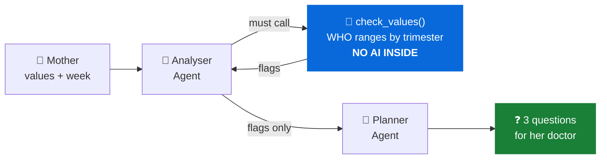

# SIVAPRASAD G

 

🌏 Open to roles worldwide &nbsp;·&nbsp; 🇯🇵 learning Japanese &nbsp;·&nbsp; ✅ available immediately

 

> [!NOTE]
> **I build AI agents that can be tested, traced and trusted — not chatbots with a good prompt.**
> My focus is the part most demos skip: keeping the model away from the decisions that matter, so the
> output is reproducible and a failure can be located in one place.

 

## 👨‍💻 About

**Python developer specialising in agentic AI on Azure**, and a **Microsoft Certified Trainer since 2020**.
I build multi-agent systems on **Microsoft Foundry**.

🏅 &nbsp;**Reasoning Agents badge** — Microsoft Agents League 2026, issued by the Global AI Community
🤖 &nbsp;**Focus** — multi-agent orchestration, function calling, tracing and evaluation
🎤 &nbsp;**Training** — hands-on sessions and labs for enterprise and university teams
📫 &nbsp;**Open to** — AI Engineer, Azure AI Engineer and AI Agent Developer roles

 

---

 

## 🤰 Featured — MotherWell (Amma Care)

**Multi-agent maternal health on Microsoft Foundry**

> *A pregnant woman enters her blood report. Sixty seconds later she has three questions for her doctor.*

The **Analyser** must call the Python tool — it cannot state a clinical range from memory.
The **Planner** sees only the flags, so it cannot introduce a number the tool did not produce.
Deployed as a traced Foundry workflow: **8.9 seconds, ₹1.11 per two reports.** Refuses to diagnose, by design.

`Python` &nbsp;`Microsoft Foundry` &nbsp;`Function calling` &nbsp;`Multi-agent orchestration` &nbsp;`OpenTelemetry`

 

---

 

## 🏅 OnboardIQ — *Reasoning Agents Badge*

**Four-agent enterprise onboarding platform · Microsoft Agents League 2026**

Four coordinating agents on Azure AI Foundry — **HR Pulse** (policy-grounded compliance),
**Team Context** (role-specific roadmaps), **Review Gate** (risk-aware auditing) and
**OnboardBuddy** (conversational support) — with a Streamlit interface, role-based dashboards,
accessibility features and six-language localisation.

**Awarded the Reasoning Agents badge**, issued by the Global AI Community, 23 July 2026.

`Python` &nbsp;`Azure AI Foundry` &nbsp;`Azure OpenAI` &nbsp;`Streamlit`

 

---

 

## 📚 Shiksha Copilot

**Multilingual classroom-support agent · AI Dev Days Hackathon 2026**

An agent on Azure AI Foundry summarising learning concepts in **15+ Indian languages**.

 

---

 

## 🛠 Stack

| | |
| :--- | :--- |
| **Languages** | `Python` &nbsp;`SQL` &nbsp;`HTML` &nbsp;`CSS` |
| **AI & Agents** | `Microsoft Foundry` &nbsp;`Azure OpenAI` &nbsp;`Function calling` &nbsp;`Multi-agent orchestration` &nbsp;`Prompt engineering` |
| **Backend** | `Django` &nbsp;`REST APIs` |
| **Tooling** | `Git` &nbsp;`GitHub` &nbsp;`VS Code` &nbsp;`Streamlit` &nbsp;`GitHub Copilot` |

 

---

 

## 🏆 Certifications

<b>&nbsp;Full certification history</b>

 

| Credential | Since |
| :--- | :--- |
| Microsoft Certified Trainer (MCT) | May 2020 |
| Microsoft Certified: Azure AI Engineer Associate | 2021 |
| Azure AI Fundamentals · Azure Fundamentals | 2020 |
| MCSD: App Builder · MCSA: Web Applications | 2019 |
| MTA: Programming Using Python | 2022 |

 

---

 

## 📈 Activity

  

<picture>
  <source media="(prefers-color-scheme: dark)" srcset="https://github-profile-summary-cards.vercel.app/api/cards/profile-details?username=sprasadgdev&theme=github_dark" />
  
</picture>

  

<picture>
  <source media="(prefers-color-scheme: dark)" srcset="https://streak-stats.demolab.com?user=sprasadgdev&hide_border=true&theme=dark&ring=0969DA&fire=0969DA&currStreakLabel=0969DA" />
  
</picture>
<picture>
  <source media="(prefers-color-scheme: dark)" srcset="https://github-profile-summary-cards.vercel.app/api/cards/stats?username=sprasadgdev&theme=github_dark" />
  
</picture>

  

<picture>
  <source media="(prefers-color-scheme: dark)" srcset="https://github-profile-summary-cards.vercel.app/api/cards/repos-per-language?username=sprasadgdev&theme=github_dark" />
  
</picture>
<picture>
  <source media="(prefers-color-scheme: dark)" srcset="https://github-profile-summary-cards.vercel.app/api/cards/most-commit-language?username=sprasadgdev&theme=github_dark" />
  
</picture>

  

<picture>
  <source media="(prefers-color-scheme: dark)" srcset="https://github-profile-summary-cards.vercel.app/api/cards/productive-time?username=sprasadgdev&theme=github_dark&utcOffset=7" />
  
</picture>

  

 

---

 

### 🤝 Let's work together

**Open to AI Engineer, Azure AI Engineer and AI Agent Developer roles — worldwide.**

Available for Azure AI architecture consulting and enterprise Python training.

 

<i>I turn real business problems into AI systems that can be tested, traced and trusted.</i>

